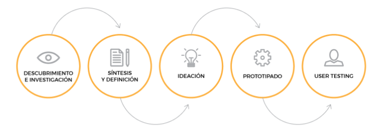
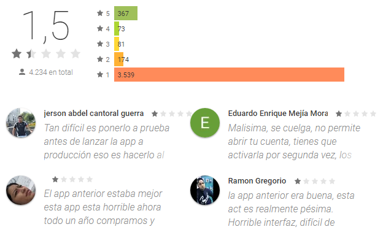
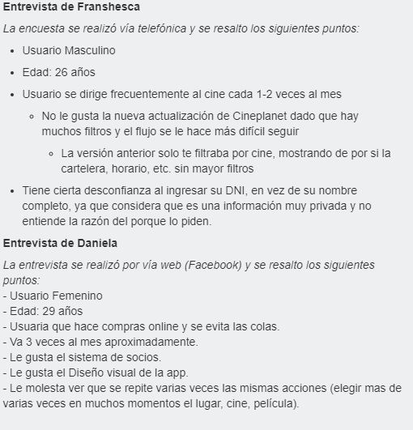
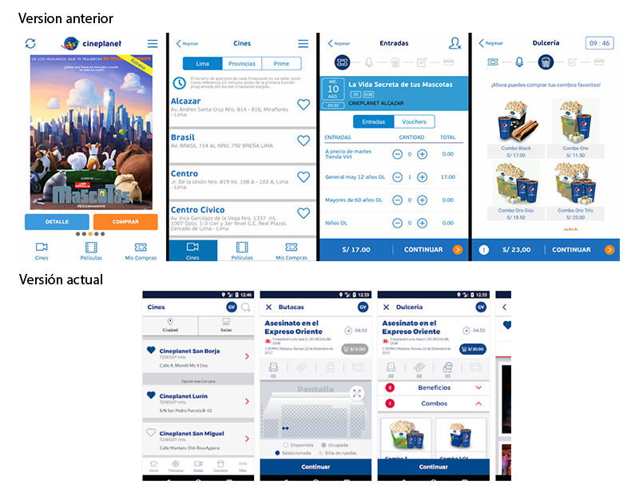
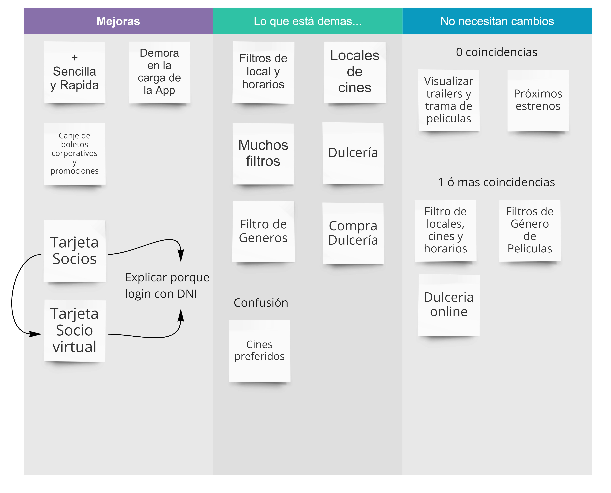
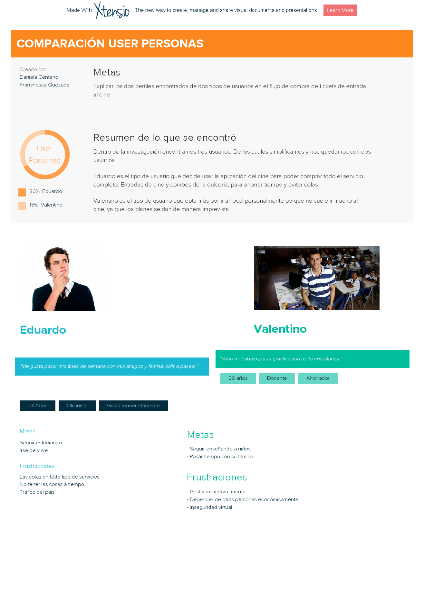

# Cineplanet
___
## Desarrollado para:
[Laboratoria](http://www.laboratoria.la/)

### Reto:
   >> "The bible app" o aplicaciónes similares.
    Elige una app del App Store o Play Store que tenga muchas descargas pero que su experiencia no sea tan buen, Testéala, re-diseñala e impleménta tu versión mejorada.

Según el reto propuesto, se decidió re-diseñar la app de Cineplanet por las bajas califacaciones de los usuarios. 

Para este reto nos hemos divido las tareas de las diferentes especializaciones en [Trello](https://trello.com/b/IfyHLGVR) :

__Front-end__:

Investigación de:

- API con react
- Data de cineplanet (API)
- SVG
- Zoom
- Redux y react
- CCS3

__UX Design__
 
  Research

- Encuesta online y entrevistas
- Affinity Map
- User Persona
- Contento prototype
- Mock-Up _(baja-alta fidelidad)_
- Testing y feedbacks

  
### Fases del Proceso:

## Descubrimiento e Investigación:

### User Research

* Research Cuantitativo: 

    - [Encuestas por internet](https://docs.google.com/spreadsheets/d/1KPCZsTzh5zM4L1VSZGQGw2ma4xxyb17DRdCutmYjwpM/edit)
    - Feedback de los usuarios en PlayStore
    

* Research Cualitativo: 

*Análisis situacional*:

Tras la reciente actualización de la aplicación de Cineplanet, los usuarios se sienten disconformes y prefieren la versión anterior.

### Síntesis y Definición:

A partir de los insight se encontro lo siguiente:

### Mapa de afinidad (Affinity Map):

Mediante este metodo, se agruparon los comentarios en 3 grupos: 

### Selección del problema

Debido que se notó una gran disconformidad con la ultima actualización, la mayoría concidía que había demasiados flujos y los confundía

### Definición del problema

Las mayoría de los usuarios coincidia que el flujo de las opciones se volvía repetitiva como la 'ubicación' y 'cines', y 'películas'.

### Ideación

### User Persona:
Se elaboró los siguientes perfiles de nuestro público objetivo en base a la información de nuestros usuarios.

Hay 3 tipos de usuarios pero redundamos a 2:

__Eduardo__:

Es el tipo de usuario que frecuenta el cine cada vez que puede y para ello, esta pendiente de los estrenos en la app de 'Cineplanet'. El compra sus entradas y combos mediante la aplicación dado que es más rápido y no tiene que realizar largas colas

__Valentino__:

Es el tipo de usuario que es más tradicional; Le encanta el cine y realiza cualquier transacción personalmente ya que no confía mucho en compras online. Va con su familia y paga con tarjeta de débito/crédito.

### Content Prototype

__Flujo de app en papel__

Clíck [aquí](https://docs.google.com/document/d/1ob0OFqFfcfIkt-Jhhhd2quLbufDMtBnNg7_VrXS64AA/edit) para ver el flujo que el usuario tomaría

### Prototipado:

Para la creación de nuestro prototipo hemos utilizado la ayuda de Marvel y Figma:

- Para ver el prototipo de manera funcional, haz [clic aquí](https://marvelapp.com/5054de5/screen/40356304)

### User Testing: Feedbacks

## Integrantes

**Front-end Developers**

- [Araceli Gutarra](https://github.com/AraceliGS)
- [Daniela Gonzales](https://github.com/Danielalab)
- [Jessica Manturano](https://github.com/JessicaMP)

**UX Designers**

- [Daniela Centeno](https://github.com/DDCenteno)
- [Franshesca Quezada](https://github.com/franshescaqm)

